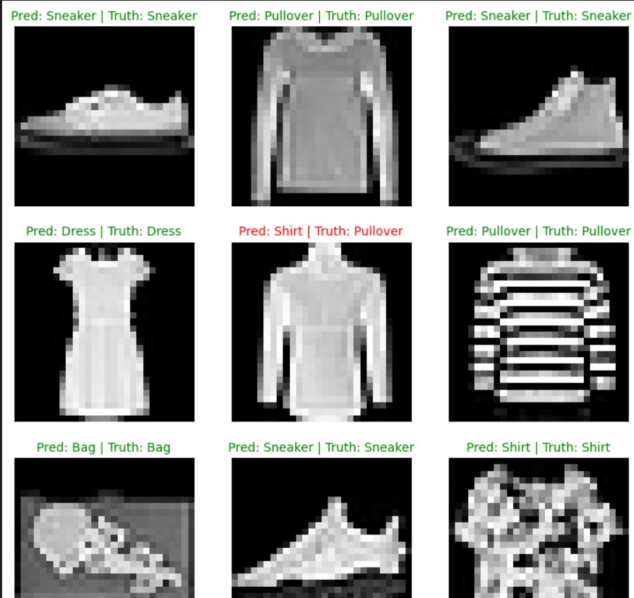
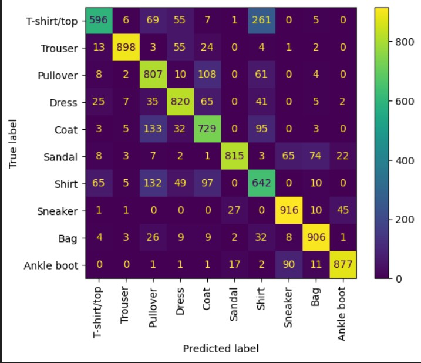

# ML beginer courses

That is a repo foe ML and Computer vision.

## Projects 
1. Fundumentals
2. Data calssifications 
3. Computer Vision
3. Custom dataset with data augmentation
### Prerequisites libraries:
* python 3.10
* ` pip install pytorch`
* ` pip install torchmetrices`
* ` pip install torchinfo`
* ` pip install numpy`
* ` pip install pandas`
* ` pip install torchvision`
* ` pip install sklearn` 
* ` pip install tqdm`

### Results

